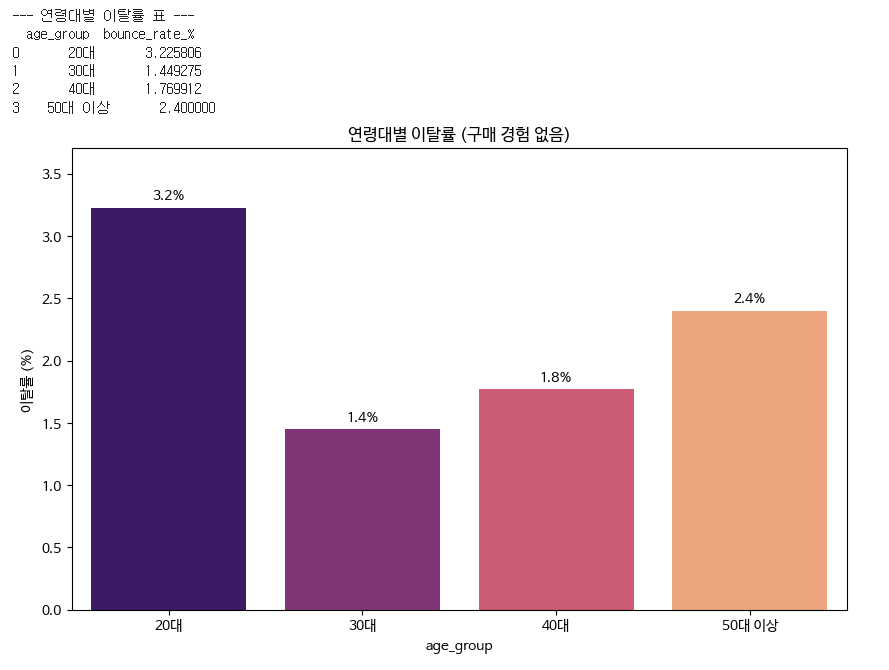

# 데이터 분석가 AI 과제 포트폴리오

## 📌 프로젝트 개요

> 이커머스 플랫폼 'ShopEasy' 의 3개월 주문 데이터를 분석하여 전자기기 카테고리의 낮은 결제 완료율(61.2%)과 20대 신규 유저의 높은 초기 이탈률(3.2%)을 핵심 문제로 정의하였고, 이를 개선하기 위한 데이터 기반 UI/UX 최적화 및 타겟 프로모션 전략과 A/B 테스트 설계안을 제시했습니다.
> 

---

## 🛠️ 사용 도구

| 도구 | 활용 목적 |
| --- | --- |
| Gemini | 분석 방향 설계, Python 코드 생성, 인사이트 도출 |
| Google Colab | Python 코드 실행 및 데이터 분석 |
| Google Looker Studio | 대시보드 제작 및 시각화 |
| Notion | 결과물 정리 및 문서화 |

---

## 🔍 분석 과정

### STEP 1. 데이터 생성 및 탐색

> ChatGPT로 더미 데이터 생성 후 구글 시트에 정리
> 

**데이터 구성**

| 데이터 | 건수 | 주요 컬럼 |
| --- | --- | --- |
| 주문 데이터 (orders) | 1,000건 | order_id, user_id, category, amount, order_status, order_date |
| 유저 데이터 (users) | 500건 | user_id, age_group, gender, join_date, last_login, purchase_count |
| 세션 데이터 (sessions) | 2,000건 | session_id, user_id, entry_page, exit_page, session_duration, device |

---

### STEP 2. Python 분석 (Google Colab)

> 비즈니스 질문 3가지에 대한 분석 수행
> 

**질문 1: 어떤 유저 세그먼트에서 이탈이 가장 많이 발생하고 있는가?**

```python
# 구매 횟수가 0인 유저를 구분하는 컬럼 생성
users['is_bounced'] = users['purchase_count'] == 0 # 구매횟수가 0이면 True, 아니면 False

# 연령대별로 이탈 여부의 평균을 구함 (True는 1, False는 0으로 계산되어 바로 비율이 됨)
age_bounce_rate = users.groupby('age_group')['is_bounced'].mean().reset_index() # 연령대별 평균 계산
age_bounce_rate['bounce_rate_%'] = age_bounce_rate['is_bounced'] * 100 # 소수를 백분율로 변환

print("--- 연령대별 이탈률 표 ---")
print(age_bounce_rate[['age_group', 'bounce_rate_%']]) # 결과 표 출력

# 시각화
plt.figure(figsize=(10, 6))

# 막대 그래프 생성(ax 변수에 담기)
ax = sns.barplot(x='age_group', y='bounce_rate_%', data=age_bounce_rate, 
                 palette='magma', hue='age_group', legend=False)

# for 반복문으로 모든 막대에 수치 표시
for container in ax.containers:
    ax.bar_label(container, fmt='%.1f%%', padding=3)

plt.title('연령대별 이탈률 (구매 경험 없음)')
plt.ylabel('이탈률 (%)')

# 숫자가 위쪽에 잘리지 않게 y축 상단에 15% 정도 여유 부여
plt.ylim(0, age_bounce_rate['bounce_rate_%'].max() * 1.15) 
plt.show()
```

▼ 분석 결과 스크린샷


- 분석 결과: 20대 연령층이 약 3.2%로 가장 높은 이탈률을 보이며, 50대 이상은 약 2.4%로 20대에 이어서 높은 이탈률을 보이고 있음.
- 인사이트:
    - ShopEasy의 현재 UI/UX나 초기 상품 구성이 20대의 취향이나 모바일 사용 습관에 최적화되지 않았을 가능성이 큼. 트렌드에 민감한 20대에게 '첫인상'에서 합격점을 받지 못하고 있다는 증거.
    - 디지털 취약층일 수 있는 50대 이상 유저들에게는 '검색'이나 '결제' 과정이 복잡하게 느껴질 수 있음(이 연령층이 선호하는 브랜드나 상품 카테고리가 부족할 때 나타날 수도 있음 ).
    - 현재 ShopEasy가 제공하는 서비스 모델(상품군, 가격대, 결제 편의성 등)이 30대 유저의 라이프스타일과 아주 잘 맞고 있다고 판단할 수 있음. 이들을 대상으로 하는 '리텐션 마케팅'이 가장 효율이 좋을 것으로 보임.

---

**질문 2: 어떤 상품 카테고리에서 전환율이 낮은가?**

```python
# 카테고리별 주문 상태 개수 계산
category_status = orders.groupby(['category', 'order_status']).size().unstack(fill_value=0) # 상태별 카운트 표 생성

# 완료율 계산 (완료 건수 / 전체 건수)
category_status['completion_rate_%'] = (category_status['완료'] / category_status.sum(axis=1)) * 100 # 완료율 컬럼 추가
category_status_final = category_status.reset_index() # 인덱스 초기화

print("--- 카테고리별 주문 완료율 표 ---")
print(category_status_final[['category', 'completion_rate_%']]) # 결과 표 출력

# 시각화
plt.figure(figsize=(10, 6))

# 막대 그래프 생성 (ax 변수에 담기)
ax = sns.barplot(x='category', y='completion_rate_%', data=category_status_final, 
                 palette='viridis', hue='category', legend=False)

# for 반복문으로 모든 막대에 수치 표시
# fmt='%.1f%%' : 소수점 첫째 자리까지 표시하고 뒤에 % 기호를 붙임
for container in ax.containers:
    ax.bar_label(container, fmt='%.1f%%', padding=3)

plt.title('카테고리별 주문 완료율') # 제목 설정
plt.ylabel('완료율 (%)') # y축 라벨 설정
plt.ylim(0, 115) # 수치가 그래프 천장에 붙지 않도록 여유 공간 확보 (0~115)
plt.show()
```

▼ 분석 결과 스크린샷


- 분석 결과: 전자기기 카테고리가 약 61.2%로 가장 낮은 주문 완료율을 보이는 반면, 홈리빙 카테고리는 약 72%로 가장 높은 주문 완료율을 보이고 있음. 뷰티·식품·패션은 약 67%~68%의 주문 완료율을 보이고 있음.
- 인사이트:
    - 전자기기는 다른 품목(식품, 뷰티 등)에 비해 단가가 높은 '고관여 상품'으로, 장바구니에 담긴 후에도 결제 직전 단계에서 고민하다가 구매를 포기하거나 취소하는 비중이 매우 높음을 의미함.
    - 홈리빙 상품을 주문하는 유저들은 구매 의사가 매우 뚜렷하며, 장바구니에 담긴 상품이 실제 결제까지 이어지는 속도가 빠르고 안정적임. 이는 전자기기에 비해서 저관여·고빈도(투자 비용도 저렴하고 접근성이 좋으며 집 꾸미기(홈퍼니싱)에 대한 심리적 만족도가 높음)인 홈리빙 상품의 특성이 반영된 것으로 보임.
    - 식품(68.6%), 패션(67.8%), 뷰티(67.3%) 카테고리는 필수 소비재 카테고리로, 모두 60% 후반대의 비슷한 주문 완료율을 보임. 유저들이 일상적으로 반복 구매하는 품목으로, 특별한 결제 방해 요소 없이 무난한 흐름을 유지하고 있음.

---

**질문 3: 세션 수 대비 구매 완료율이 낮은 원인은 무엇인가?**

```python
# 구매 전환 여부 컬럼 생성 (이탈 페이지가 '완료'이면 구매로 간주)
sessions['is_converted'] = sessions['exit_page'] == '완료' # 전환 여부 판단

# 진입 페이지별로 세션 시간 평균과 전환율(평균) 계산
session_analysis = sessions.groupby('entry_page').agg({
    'session_duration': 'mean', # 체류 시간 평균
    'is_converted': 'mean' # 전환율 평균
}).reset_index()

session_analysis['conversion_rate_%'] = session_analysis['is_converted'] * 100 # 백분율 변환

print("--- 진입 페이지별 분석 표 ---")
print(session_analysis[['entry_page', 'session_duration', 'conversion_rate_%']]) # 결과 표 출력

# 시각화 
fig, ax1 = plt.subplots(figsize=(12, 6))

# 1. 평균 체류 시간 (막대 그래프)
ax = sns.barplot(x='entry_page', y='session_duration', data=session_analysis, 
                 ax=ax1, alpha=0.6, color='blue', label='평균 체류 시간(초)')
ax1.set_ylabel('평균 체류 시간 (초)')

# for 반복문으로 모든 막대에 수치 표시 (단위: 초)
for container in ax1.containers:
    ax1.bar_label(container, fmt='%.0f초', padding=3)

# 2. 구매 전환율 (선 그래프)
ax2 = ax1.twinx()
sns.lineplot(x='entry_page', y='conversion_rate_%', data=session_analysis, 
             ax=ax2, marker='o', color='red', label='구매 전환율(%)')
ax2.set_ylabel('구매 전환율 (%)')

# for 반복문으로 선 그래프의 점 위에 수치 표시 (단위: %)
# x축의 위치(i)와 전환율 값(val)을 하나씩 가져와서 텍스트로 사용
for i, val in enumerate(session_analysis['conversion_rate_%']):
    ax2.text(i, val + 0.5, f'{val:.1f}%', color='white', 
             ha='center', va='bottom', fontweight='bold')

# 3. 범례 합치기 및 위치 조정
lines1, labels1 = ax1.get_legend_handles_labels()
lines2, labels2 = ax2.get_legend_handles_labels()
ax2.legend(lines1 + lines2, labels1 + labels2, loc='upper right')

# 불필요한 중복 범례 제거 및 여유 공간 설정
if ax1.get_legend(): ax1.get_legend().remove()
ax1.set_ylim(0, session_analysis['session_duration'].max() * 1.2)
ax2.set_ylim(session_analysis['conversion_rate_%'].min() * 0.8, 
             session_analysis['conversion_rate_%'].max() * 1.2)

plt.title('진입 페이지별 체류 시간 및 구매 전환율')
plt.show()
```

▼ 분석 결과 스크린샷


- 분석 결과: 홈페이지는 평균 체류시간이 두 번째로 길지만 구매 전환율은 가장 낮고, 카테고리 페이지는 평균 체류시간은 가장 짧지만 구매 전환율은 가장 높음. 검색·상품상세 페이지는 평균 체류시간이 각각 310초·304초, 구매 전환율은 각각 19.9%·20.7%로 체류 시간에 비해 낮은 전환율을 보임.
- 인사이트:
    - 카테고리 페이지로 들어오는 유저들이 **'목적성 구매(Intent-based shopping)'** 성향이 매우 강함을 보여 줌. 고민하는 시간(체류 시간)은 짧지만, 원하는 상품군이 명확하여 실제 구매까지 가장 빠르고 효율적으로 이어짐.
    - 홈 페이지는 다양한 상품과 배너를 노출하지만, 유저의 시선을 분산시켜 실제 구매 결정을 내리게 하는 힘은 약함. 유저가 홈에서 '무엇을 살지' 결정하지 못하고 배회하다가 이탈하는 비중이 다른 경로에 비해 높음을 의미함.
    - 검색 유저나 상품 상세 페이지 진입 유저는 특정 상품에 관심은 있으나, 여러 옵션을 비교하거나 상세 정보를 꼼꼼히 읽는 **'신중한 탐색가'** 그룹으로 판단됨. 전환율이 카테고리 페이지보다 낮은 이유는 비교 과정에서 더 나은 대안을 찾거나 결정을 미루기 때문으로 분석됨.

---

## 📊 Google Looker Studio 대시보드

> 대시보드 링크: [ShopEasy 서비스 지표 분석 (2025 Q3)](https://lookerstudio.google.com/reporting/22fa7740-b104-4c0a-9249-20f04f2f3a13/page/eAftF)
> 

### 대시보드 구성

| 차트 종류 | 내용 |
| --- | --- |
| 막대 차트 | 카테고리별 주문 완료율 |
| 선 차트 | 월별 주문 수 추이 |
| 표 | 연령대별 구매 건수 |

▼ 대시보드 스크린샷

.png)

---

## 📝 인사이트 리포트

### 1. 요약

- **성장세 정체:** 8월 정점 이후 9월 주문 건수가 약 **13% 하락**하며 성장세가 주춤하고 있음.
- **20대 이탈 주의:** 구매 경험이 없는 유저 중 20대의 이탈률(3.2%)이 가장 높아 미래 고객 확보에 경고등 점등
- **카테고리 불균형:** '홈리빙'은 완료율이 높으나, 매출 비중이 큰 '전자기기'의 완료율(61.2%)이 가장 낮아 수익성 개선이 시급함.

### 2. 핵심 발견 사항 3가지

**발견 1: 카테고리별 주문 완료율: "전자기기, 잡았다가 놓치는 고객이 가장 많습니다.”**

- 내용: 전자기기는 단가가 높아 결제 단계에서 고민(장바구니 방치 등)하거나 취소하는 비중이 매우 높다는 것을 의미함.
- 근거 데이터: 홈리빙(72%)에 비해 전자기기(61.2%)의 주문 완료율이 10%p 이상 낮음.

**발견 2: 진입 페이지별 효율: "카테고리 메뉴가 알짜배기 '구매 통로'입니다.”**

- 내용: 카테고리 메뉴를 타는 고객은 구매 목적이 뚜렷하며, 체류 시간은 짧아도 가장 효율적으로 구매 결정을 내리고 있음.
- 근거 데이터: 카테고리 페이지를 통해 들어온 유저의 구매 전환율(23.7%)이 홈(18.2%)이나 검색(19.9%)보다 월등히 높음.

**발견 3: 연령대별 미구매자 이탈률: "20대 신규 고객에게 우리 앱은 아직 낯섭니다.”**

- 내용: 트렌드에 민감한 20대에게 현재의 UI/UX나 첫 구매 혜택이 충분히 매력적이지 않다는 신호일 수 있음.
- 근거 데이터: 30대(1.4%)에 비해 20대(3.2%)의 초기 이탈률이 2배 이상 높음.

### 3. 개선 권고사항 (우선순위 포함)

| 우선순위 | 개선안 | 예상 효과 |
| --- | --- | --- |
| 1. 전자기기 카테고리 '결제 허들' 제거 | 완료율이 낮은 전자기기 품목에 대해 **'무이자 할부 프로모션'** 또는 '한정 시간 장바구니 할인 쿠폰'을 지급 | 고객의 결제 고민 시간 단축으로 인한 주문 완료율 향상 |
| 2. 카테고리 내비게이션 최적화 | 홈 화면 하단 탭을 강화하거나, 인기 카테고리 숏컷 아이콘을 전면에 배치하여 유저가 헤매지 않고 상품군에 진입하도록 유도 | 전환율이 가장 높은 '카테고리 페이지'로의 접근성을 높여 전체 구매 전환율을 강화 |
| 3. 20대 타겟 '첫 구매 웰컴 패키지' 재설계 | 앱 설치 후 첫 진입 시 **'20대 인기 브랜드 단독 특가'** 혹은 '무료 반품권' 노출 | 심리적 진입장벽을 낮추어 20대 고객층의 이탈을 방지할 수 있음. |

---

## 🧪 A/B 테스트 설계안

> 인사이트 기반으로 검증할 A/B 테스트 설계
> 
- [테스트 1] 전자기기 카테고리 '결제 유도 장치' 도입

| 항목 | 내용 |
| --- | --- |
| 가설 | 전자기기 장바구니 유저에게 **한정 시간 할부 혜택 알림**을 제공하면, **주문 완료율**이 개선될 것이다. |
| 대조군 (A) | 현재와 동일하게 별도의 혜택 안내 없이 일반 결제 프로세스 유지. |
| 실험군 (B) | 5만 원 이상 전자기기 장바구니 진입 시 "지금 결제 시 최대 12개월 무이자" 팝업 노출 및 결제창 내 강조. |
| 측정 지표 (KPI) | 전자기기 카테고리 **주문 완료율(Completion Rate)**. |
| 테스트 기간 | **2주** (고관여 상품인 전자기기의 평균 고민 주기와 주말 결제 패턴을 반영하기 위함) |
| 주의사항 | [외부 요인] 타 이벤트와 중복 금지<br> • **실험 효과의 순수성** 확보를 위해 필요<br> [수익 지표] 건당 마진율 병행 모니터링<br> • 완료율은 높지만 **적자 판매가 되는 상황** 방지<br> [UX 경험] 메시지 노출 빈도 제어<br> • 과도한 결제 독촉으로 인한 **역이탈 방지** |
- [테스트 2] 홈 화면 '카테고리 퀵 내비게이션' 배치

| 항목 | 내용 |
| --- | --- |
| 가설 | 홈 화면 상단에 **인기 카테고리 아이콘**을 배치하면, 효율이 높은 카테고리 페이지 유입이 늘어나 **전체 구매 전환율**이 개선될 것이다. |
| 대조군 (A) | 현재의 홈 화면 구성을 그대로 유지 (일반적인 베스트 상품 나열). |
| 실험군 (B) | 홈 화면 최상단 배너 바로 아래에 전환율이 검증된 '전자기기', '식품' 등 5개 **주요 카테고리 퀵 버튼 배치** |
| 측정 지표 (KPI) | 홈 진입 유저의 **최종 구매 전환율(Conversion Rate)** |
| 테스트 기간 | **1주** (매일 발생하는 반복적인 탐색 데이터를 통해 빠르게 유의미한 표본 확보 가능) |
| 주의사항 | [영역 잠식] 기존 배너의 클릭률 변화 모니터링<br> • 새로운 버튼이 **기존 매출원을 가리는지** 확인<br> [구성 기준] 노출 카테고리 선정 기준 고정<br> • **데이터 편향성** 없는 공정한 비교를 위해 필요<br> [기술 점검] 기기별 레이아웃 및 로딩 속도<br> • **UI 깨짐이나 속도 저하**로 인한 이탈 방지<br> [종합 분석] 홈 체류 시간 외 '최종 전환율' 중시<br> • 체류 시간 감소가 **구매 효율 상승**인지 구분 |
- [테스트 3] 20대 타겟 '첫 구매 웰컴 베네핏' 개인화

| 항목 | 내용 |
| --- | --- |
| 가설 | 20대 신규 유저에게 **무료 반품 및 교환권**을 강조하면, 초기 서비스에 대한 불신이 사라져 **이탈률**이 감소할 것이다. |
| 대조군 (A) | 모든 연령대에 동일한 범용 '첫 구매 10% 쿠폰'만 노출. |
| 실험군 (B) | 20대 유저(가입 데이터 기반)에게만 "사이즈 걱정 마세요! 첫 구매 무료 반품" 혜택을 랜딩 페이지에 강조. |
| 측정 지표 (KPI) | 20대 신규 유저의 **세션 이탈률(Bounce Rate)** 및 첫 구매 성공률. |
| 테스트 기간 | **3~4주** (신규 유저 유입량에 따라 충분한 모수를 확보해야 신뢰도가 높아짐) |
| 주의사항 | [데이터 정밀도] 로그인/가입 데이터 기반 타겟팅<br> • **잘못된 타겟 노출**로 인한 데이터 오염 방지<br> [세그먼트 격리] 타 연령층 노출 차단 및 보안<br> • 혜택 차별로 인한 **기존 고객의 불만** 방지<br> [물류비용 관리] 반품률 급증 여부 상시 모니터링<br> • 이탈률 개선보다 **운영 비용**이 커지는 상황 경계<br> [인지 속도] 첫 진입 화면에서의 시인성 확보<br> • 유저가 혜택을 **인지하기도 전에 나가는 것**을 방지 |

---

## 💡 AI 코드를 수정하거나 결과를 다르게 해석한 부분

### 수정 1: STEP 2. Python 분석 (Google Colab) - **질문 1**

- **AI 결과**:

```sql
# 구매 횟수가 0인 유저를 구분하는 컬럼 생성
users['is_bounced'] = users['purchase_count'] == 0 # 구매횟수가 0이면 True, 아니면 False

# 연령대별로 이탈 여부의 평균을 구함 (True는 1, False는 0으로 계산되어 바로 비율이 됨)
age_bounce_rate = users.groupby('age_group')['is_bounced'].mean().reset_index() # 연령대별 평균 계산
age_bounce_rate['bounce_rate_%'] = age_bounce_rate['is_bounced'] * 100 # 소수를 백분율로 변환

print("--- 연령대별 이탈률 표 ---")
print(age_bounce_rate[['age_group', 'bounce_rate_%']]) # 결과 표 출력

# 시각화
plt.figure(figsize=(10, 6)) # 그래프 크기 설정
sns.barplot(x='age_group', y='bounce_rate_%', data=age_bounce_rate, palette='magma') # 막대 그래프 생성
plt.title('연령대별 이탈률 (구매 경험 없음)') # 제목 설정
plt.ylabel('이탈률 (%)') # y축 라벨
plt.show()
```

- **내 수정**:

```sql
# 구매 횟수가 0인 유저를 구분하는 컬럼 생성
users['is_bounced'] = users['purchase_count'] == 0 # 구매횟수가 0이면 True, 아니면 False

# 연령대별로 이탈 여부의 평균을 구함 (True는 1, False는 0으로 계산되어 바로 비율이 됨)
age_bounce_rate = users.groupby('age_group')['is_bounced'].mean().reset_index() # 연령대별 평균 계산
age_bounce_rate['bounce_rate_%'] = age_bounce_rate['is_bounced'] * 100 # 소수를 백분율로 변환

print("--- 연령대별 이탈률 표 ---")
print(age_bounce_rate[['age_group', 'bounce_rate_%']]) # 결과 표 출력

# 시각화
plt.figure(figsize=(10, 6))

# 막대 그래프 생성(ax 변수에 담기)
ax = sns.barplot(x='age_group', y='bounce_rate_%', data=age_bounce_rate, 
                 palette='magma', hue='age_group', legend=False)

# for 반복문으로 모든 막대에 수치 표시
for container in ax.containers:
    ax.bar_label(container, fmt='%.1f%%', padding=3)

plt.title('연령대별 이탈률 (구매 경험 없음)')
plt.ylabel('이탈률 (%)')

# 숫자가 위쪽에 잘리지 않게 y축 상단에 15% 정도 여유 부여
plt.ylim(0, age_bounce_rate['bounce_rate_%'].max() * 1.15) 
plt.show()
```

- **수정 이유**: 단순히 막대만 보여주는 그래프는 직관적으로 수치를 파악하기 힘들기 때문에, 막대 위에 수치를 표시함으로써 바로 수치를 파악할 수 있도록 변경했습니다(모든 그래프에 동일하게 적용).

### 수정 2: STEP 2. Python 분석 (Google Colab) - **질문 3**

- **AI 결과**:

```sql
# 구매 전환 여부 컬럼 생성 (이탈 페이지가 '완료'이면 구매로 간주)
sessions['is_converted'] = sessions['exit_page'] == '완료' # 전환 여부 판단

# 진입 페이지별로 세션 시간 평균과 전환율(평균) 계산
session_analysis = sessions.groupby('entry_page').agg({
    'session_duration': 'mean', # 체류 시간 평균
    'is_converted': 'mean' # 전환율 평균
}).reset_index()

session_analysis['conversion_rate_%'] = session_analysis['is_converted'] * 100 # 백분율 변환

print("--- 진입 페이지별 분석 표 ---")
print(session_analysis[['entry_page', 'session_duration', 'conversion_rate_%']]) # 결과 표 출력

# 시각화 (2개의 그래프를 한 번에 출력)
fig, ax1 = plt.subplots(figsize=(12, 6))

# 1. 평균 체류 시간 (막대 그래프)
sns.barplot(x='entry_page', y='session_duration', data=session_analysis, ax=ax1, alpha=0.6, color='blue', label='평균 체류 시간(초)')
ax1.set_ylabel('평균 체류 시간 (초)') # 좌측 y축 설정

# 2. 구매 전환율 (꺾은선 그래프)
ax2 = ax1.twinx() # y축 공유를 위한 설정
sns.lineplot(x='entry_page', y='conversion_rate_%', data=session_analysis, ax=ax2, marker='o', color='red', label='구매 전환율(%)')
ax2.set_ylabel('구매 전환율 (%)') # 우측 y축 설정

plt.title('진입 페이지별 체류 시간 및 구매 전환율')
plt.show() # 그래프 출력
```

- **내 수정**:

```sql
# 구매 전환 여부 컬럼 생성 (이탈 페이지가 '완료'이면 구매로 간주)
sessions['is_converted'] = sessions['exit_page'] == '완료' # 전환 여부 판단

# 진입 페이지별로 세션 시간 평균과 전환율(평균) 계산
session_analysis = sessions.groupby('entry_page').agg({
    'session_duration': 'mean', # 체류 시간 평균
    'is_converted': 'mean' # 전환율 평균
}).reset_index()

session_analysis['conversion_rate_%'] = session_analysis['is_converted'] * 100 # 백분율 변환

print("--- 진입 페이지별 분석 표 ---")
print(session_analysis[['entry_page', 'session_duration', 'conversion_rate_%']]) # 결과 표 출력

# 시각화 
fig, ax1 = plt.subplots(figsize=(12, 6))

# 1. 평균 체류 시간 (막대 그래프)
ax = sns.barplot(x='entry_page', y='session_duration', data=session_analysis, 
                 ax=ax1, alpha=0.6, color='blue', label='평균 체류 시간(초)')
ax1.set_ylabel('평균 체류 시간 (초)')

# 막대 그래프 위에 수치 표시 (단위: 초)
for container in ax1.containers:
    ax1.bar_label(container, fmt='%.0f초', padding=3)

# 2. 구매 전환율 (라인 차트)
ax2 = ax1.twinx()
sns.lineplot(x='entry_page', y='conversion_rate_%', data=session_analysis, 
             ax=ax2, marker='o', color='red', label='구매 전환율(%)')
ax2.set_ylabel('구매 전환율 (%)')

# 라인 차트의 점 위에 수치 표시 (단위: %)
# x축의 위치(i)와 전환율 값(val)을 하나씩 가져와서 텍스트로 사용
for i, val in enumerate(session_analysis['conversion_rate_%']):
    ax2.text(i, val + 0.5, f'{val:.1f}%', color='white', 
             ha='center', va='bottom', fontweight='bold')

# 3. 범례 합치기 및 위치 조정
lines1, labels1 = ax1.get_legend_handles_labels()
lines2, labels2 = ax2.get_legend_handles_labels()
ax2.legend(lines1 + lines2, labels1 + labels2, loc='upper right')

# 불필요한 중복 범례 제거 및 여유 공간 설정
if ax1.get_legend(): ax1.get_legend().remove()
ax1.set_ylim(0, session_analysis['session_duration'].max() * 1.2)
ax2.set_ylim(session_analysis['conversion_rate_%'].min() * 0.8, 
             session_analysis['conversion_rate_%'].max() * 1.2)

plt.title('진입 페이지별 체류 시간 및 구매 전환율')
plt.show()
```

- **수정 이유**: 기존의 코드는 막대 그래프의 범례와 라인 차트의 범례가 우측 상단에 그래프를 약간 덮으면서 서로 겹쳐진 상태로 출력되었기 때문에, 이를 해결하고자 두 범례를 하나로 합치고 중복되는 범례를 제거하면서 그래프의 크기와 범례 위치 등을 더욱 여유있게 조정하였습니다.

### 수정 3: “**질문 2: 어떤 상품 카테고리에서 전환율이 낮은가?” - 인사이트**

- **AI 결과**:

> 홈리빙 상품을 주문하는 유저들은 구매 의사가 매우 뚜렷하며, 장바구니에 담긴 상품이 실제 결제까지 이어지는 속도가 빠르고 안정적임. 이는 해당 카테고리의 상품 설명이나 리뷰가 유저에게 충분한 신뢰를 주고 있음을 시사하고 있음.
> 
- **내 수정**:

> 홈리빙 상품을 주문하는 유저들은 구매 의사가 매우 뚜렷하며, 장바구니에 담긴 상품이 실제 결제까지 이어지는 속도가 빠르고 안정적임. 이는 전자기기에 비해서 저관여·고빈도(투자 비용도 저렴하고 접근성이 좋으며 집 꾸미기(홈퍼니싱)에 대한 심리적 만족도가 높음)인 홈리빙 상품의 특성이 반영된 것으로 보임.
> 
- **수정 이유**: 기존에 AI가 알려준 인사이트는 우리가 가진 데이터에서는 확실하게 파악할 수 없는 내용을 담고 있기 때문에(해당 카테고리의 상품 설명이나 리뷰가 유저에게 충분한 신뢰를 주고 있음), 구체적이고 정확한 근거로 제시하기에는 위험 부담이 컸습니다. 따라서 “전자기기는 고관여 상품”이라는 점에 주목하여 해당 부분에 대한 정보를 재조사하였고, 재조사한 내용을 바탕으로 인사이트와 그 근거를 약간 수정했습니다.

---
